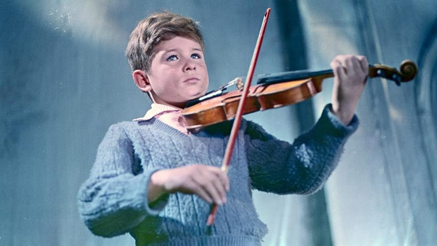

```{r setup, include=FALSE}
knitr::opts_chunk$set(echo = TRUE)
```

# AndreiColors
R color palettes, inspired from the movies of Andrei Arsenyevich Tarkovsky (Андрей Арсеньевич Тарковский), a Russian filmmaker and theorist. He is widely considered one of the greatest and most influental directors in the history of Russian and world cinema.

The colors of all his (color) movies in R color palettes.

The [`colormind`](http://colormind.io/image/) website was used to extract color from still images of the movies and structure of code was inspired by the [`PNWColors`](https://github.com/jakelawlor/PNWColors) package and by the
[`musculusColors`](https://github.com/dawnbarlow/musculusColors) package.


**Table of Contents**  
[Install](#Install)   
[Running](#Running-the-package)   
[Palettes](#Palettes)  
[Example Plots](#Example-Plots)  


## Install
```r
# dev version
library(devtools)
devtools::install_github("/JoshEbner/AndreiColors")
```

## Running the package
```r
library(AndreiColors)
names(at_palette)
  [1] "stalker"   "nostalghia" "solaris"    "mirror"   "sacrifice"    "violin"
```

## Palettes

```r
at_palette("stalker")
```


```r
at_palette("nostalghia")
```


```r
at_palette("solaris")
```


```r
at_palette("mirror")
```


```r
at_palette("violin")
```


## Example Plots
```r
library(hexbin)
ggplot(data.frame(x = rnorm(1e4), y = rnorm(1e4)), aes(x = x, y = y)) +
  geom_hex() +
  coord_fixed() +
  scale_fill_gradientn(colours = at_palette("solaris", n=50)) +
  theme_classic()
```


```r
ggplot(diamonds, aes(carat, fill = cut)) +
  geom_density(position = "stack") +
  scale_fill_manual(values=at_palette("nostalghia",5, type = "discrete"))  +
  theme_classic()
```


```r
ggplot(diamonds, aes(x=cut, y=carat, fill = cut)) +
  geom_boxplot() +
  scale_fill_manual(values=at_palette("solaris", 5))  +
  theme_classic()
```


```r
ggplot(diamonds, aes(carat, fill = cut)) +
  geom_density(position = "stack") +
  scale_fill_manual(values=at_palette("mirror",5, type = "discrete"))  +
  theme_classic()
```


```r
ggplot(diamonds, aes(x=cut, y=carat, fill = cut)) +
  geom_boxplot() +
  scale_fill_manual(values=at_palette("violin", 5))  +
  theme_classic()
```


```r
library(hexbin)
ggplot(data.frame(x = rnorm(1e4), y = rnorm(1e4)), aes(x = x, y = y)) +
  geom_hex() +
  coord_fixed() +
  scale_fill_gradientn(colours = rev(at_palette("sacrifice", n=50))) +
  theme_classic()
```

